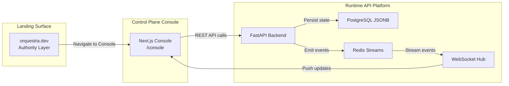
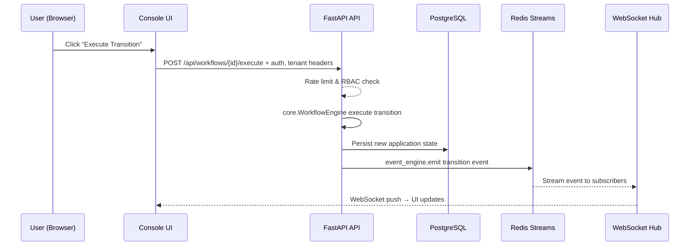
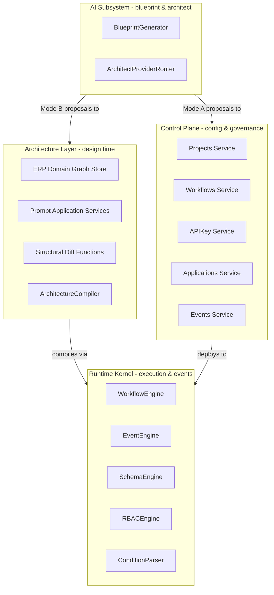
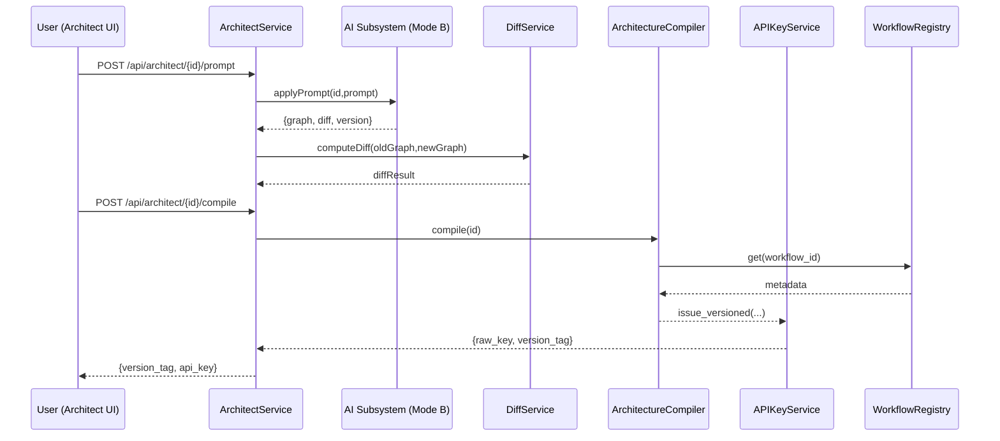
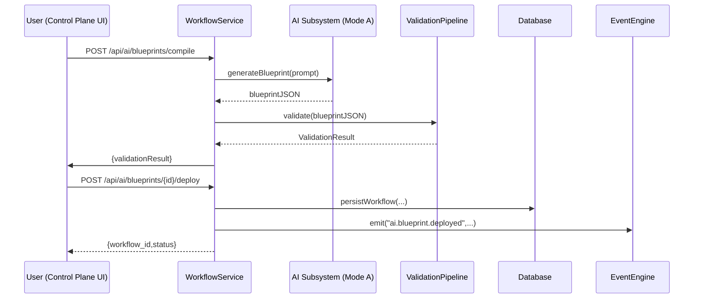
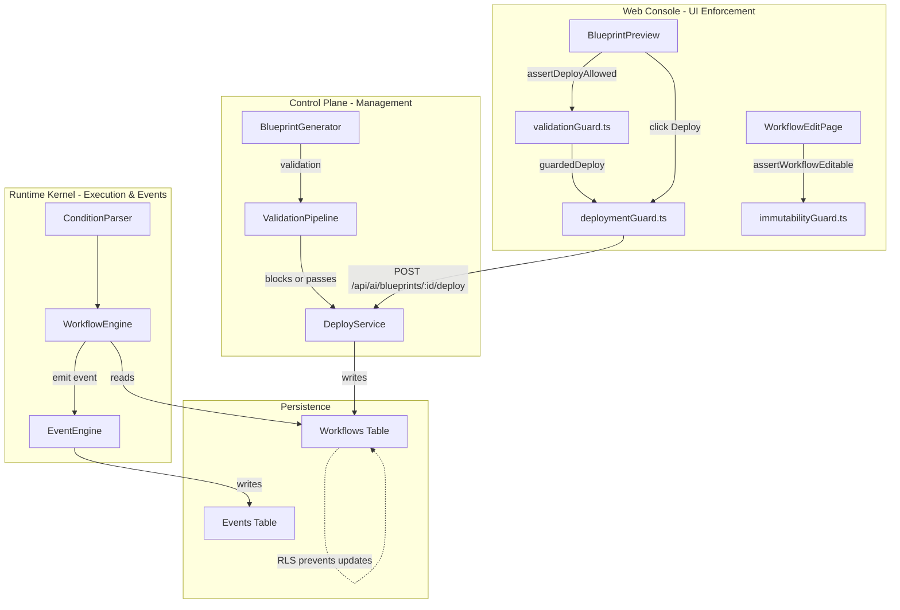
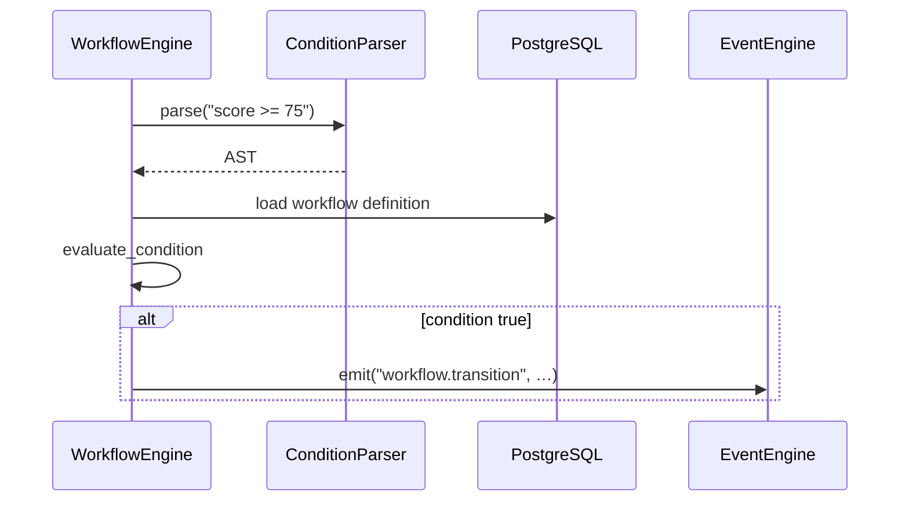
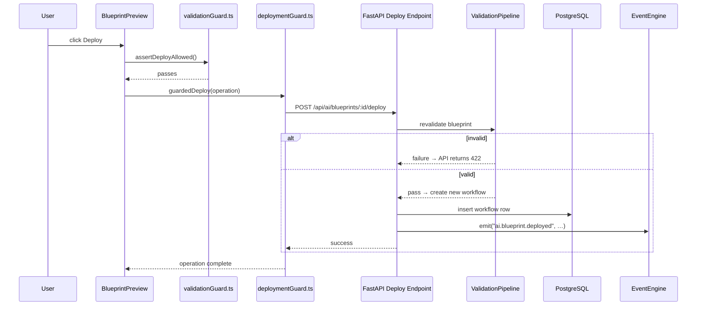
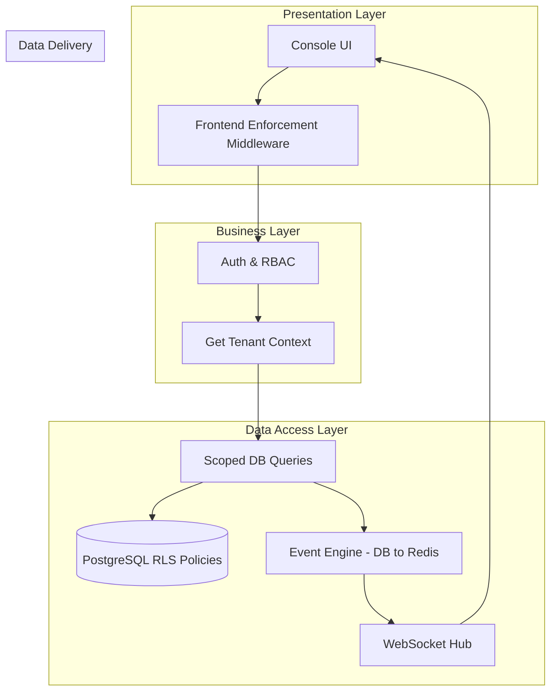
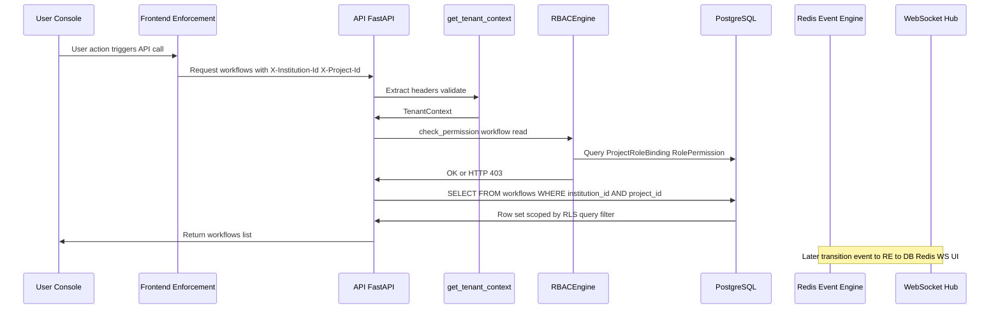

# ORQUESTRA - A Headless-API-ERP

Orquestra is a headless, AI-native ERP infrastructure for universities and edtech, enabling natural language deployment of validated workflow blueprints, event-driven backends, and secure multi-tenant control planes.

## Overview

This repo implements programmable institutional workflows as deterministic state machines. Developers describe processes in English; AI generates/deploys infrastructure including workflows, schemas, roles, and events. Targets admissions, expanding to registration/HR.

![Master architecture: 4-layer control plane from client surfaces to data persistence.]

## Features

- **AI Blueprint Generator**: 4-stage validation (schema/graph/permission/compliance) before human-approved deployment.
- **Workflow Engine**: Safe, no-eval execution with real-time events via Redis streams.
- **Event Backbone**: Structured emissions (e.g., `workflow.transitioned`) for integrations.
- **Multi-Tenant Security**: JWT/API keys, RLS, CSP, zero-trust from ground up.
- **Developer Console**: Dashboard, templates, API playground, live event streams.

## Tech Stack

**Backend:** FastAPI (Python 3.11), PostgreSQL 15 (RLS/JSONB), Redis 7 (streams), OpenAI GPT-4 Turbo (function calling).

**Frontend:** Next.js 14 (React 18, App Router), Tailwind CSS (design tokens), Zustand, Monaco Editor.

**Security/Infra:** JWT/PyJWT, CSP headers, Railway/Vercel hosting, Sentry monitoring.

![Multi-tenant isolation: JWT → RLS → scoped queries.]


# Three-Surface Product Model & Request/Data Flow

This section introduces Orquestra’s **Three-Surface Product Model**—the distinct user-facing, control, and runtime layers—and describes the canonical end-to-end request and data flow through the system. Understanding these surfaces and their interactions is critical to maintaining the core invariants: strict multi-tenant isolation, deterministic execution, immutable workflows, and real-time observability.

The three surfaces are:

1. **Authority Layer (Landing)**

The marketing and documentation gateway at orquestra.dev, guiding new users into the platform.

1. **Control Plane (Console)**

The Next.js-based developer interface at `/console` for managing projects, workflows, templates, AI compilation, and viewing events.

1. **Runtime API Platform**

The FastAPI backend exposing REST and WebSocket endpoints for deterministic workflow execution, persistence, event streaming, and API key management .

All user actions—whether via the Console UI or direct API calls—flow through a fixed pipeline:

**authentication + rate limiting → workflow execution → DB persistence → Redis Streams → WebSocket push** . Each transition emits a structured event, guaranteeing real-time observability and strict separation of concerns.

## Architecture Overview



## Component Structure

### 1. Presentation Layer

#### **Landing Pages** (`apps/web/src/app/(landing)`)

- **Purpose:** Authority and documentation gateway, routing users to Console, Docs, or Architecture overview.
- **Responsibilities:**- Marketing hero with “Launch Console”, “Read Docs”, “View Architecture” CTAs
- Three entry-point cards: Developer Console, Architecture & Runtime, API & Documentation

#### **Console Control Plane** (`apps/web/src/app/console`)

- **Purpose:** Developer-centric control plane UI for managing every aspect of institutional workflows and infrastructure.
- **Key Features:**- Project selector and context bar
- Workflow list, detail/editor, AI Blueprint Generator
- Template gallery and deploy flow
- ERP Architect canvas with version history
- Live event stream via WebSocket
- **Data Fetching:** Uses `@/lib/console-api` methods (e.g., `getProjects`, `listWorkflows`, `listEvents`) with tenant headers attached by Frontend Enforcement Middleware.

### 2. Business Layer

#### **Control Plane Services** (`apps/api/app/control_plane`)

| Service Module | Responsibility |
| --- | --- |
| `projects/service.py` | CRUD for projects |
| `workflows/service.py` | Validate, version, deploy workflows (invokes core engines) |
| `templates/service.py` | List, deploy templates |
| `api_keys/service.py` | Issue and revoke versioned API keys |
| `events/service.py` | Query historical events |


### 3. Data Access Layer

#### **Backend Engines & Middleware** (`apps/api/app`)

| Component | Purpose |
| --- | --- |
| `middleware/RateLimitMiddleware` | Redis-backed rate limiting |
| `core/workflow_engine.py` | Deterministic JSON state machine executor |
| `core/event_engine.py` | Emit events, write to PostgreSQL, push to Redis Streams |
| `core/rbac_engine.py` | Enforce action-level permissions |
| `core/schema_engine.py` | JSON Schema + Pydantic validation |
| `ws.py` (WebSocket hub) | Authenticate, scope, and broadcast real-time events |


### 4. Data Models

Orquestra persists everything as JSONB and immutable event records. Key tables:

- `**workflows**`: Definition + version + status
- `**applications**`: Workflow instances + current state
- `**events**`: Ordered domain events with payload, tenant context
- `**projects**`**, **`**institutions**`: Tenant and workspace isolation

## API Integration

**Core Endpoints for Control Plane & Runtime:**

- **Authentication**

• POST /api/auth/login

• GET /api/auth/me

- **Projects & Context**

• GET /api/projects

- **Workflows**

• GET /api/workflows

• POST /api/workflows → deploy new definition

- **Templates**

• GET /api/templates

• POST /api/templates/{id}/deploy

- **Events (History + Stream)**

• GET /api/events?limit=…

• WS /ws/events?institution_id={…}&project_id={…}

- **AI Blueprint**

• POST /api/ai/blueprint/compile

• POST /api/ai/blueprint/deploy

- **ERP Architect**

• GET /api/architect/{id}

• POST /api/architect/{id}/prompt

• POST /api/architect/{id}/compile

## Feature Flows

### Workflow Execution & Event Propagation



## Integration Points

- **Authentication & Tenant Enforcement**

All HTTP and WS endpoints require JWT + `X-Institution-Id`/`X-Project-Id` headers.

- **Rate Limiting**

Redis-backed middleware applies per-tenant quotas.

- **Event Backbone**

`EventEngine` writes to Redis Streams; `ws.py` subscribes and broadcasts.

- **Frontend Enforcement Middleware**

Intercepts requests to inject tenant context, enforce immutability, and guard validation/deploy flows.

## Key Classes Reference

| Class | Location | Responsibility |
| --- | --- | --- |
| `FastAPI` | `apps/api/app/main.py` | App setup, CORS, middleware, router mounting |
| `RateLimitMiddleware` | `apps/api/app/middleware/rate_limit.py` | Redis-backed HTTP rate limiting |
| `WorkflowEngine` | `apps/api/app/core/workflow_engine.py` | Deterministic state transition execution |
| `EventEngine` | `apps/api/app/core/event_engine.py` | Event emission → PostgreSQL + Redis Streams |
| `RbacEngine` | `apps/api/app/core/rbac_engine.py` | Action-level permission enforcement |
| `SchemaEngine` | `apps/api/app/core/schema_engine.py` | Blueprint & data model validation |
| `Hub` | `apps/api/app/ws.py` | WebSocket authentication, subscription, broadcast |
| `ConsoleShell` | `apps/web/src/components/console/ConsoleShell.tsx` | Master layout, context bar, sidebar navigation |
| `useEventStream` hook | `apps/web/src/lib/hooks/useEventStream.ts` | Backfill + WebSocket connection for real-time UI |
| `DOC_NAV_GROUPS` & `INTRODUCTION_PAGE` | `apps/web/src/data/docs.ts` | Three-Surface & Platform Invariants content |

# Layer Boundaries & Dependency Rules

## Overview

This section defines the strict boundaries and dependency constraints among Orquestra’s four backend layers: the Runtime Kernel, Control Plane, AI Subsystem, and Institutional Architecture Layer (IAL). By treating the Runtime Kernel like an OS kernel and enforcing one-way dependencies downward, the system guarantees deterministic behavior, safety from cross-layer side-effects, and full auditability of all structural and configuration changes. AI-generated proposals flow only through sanctioned channels and require explicit human validation and deployment, while the IAL remains a purely design-time surface that never executes workflows.

## Architecture Overview



## Layer Definitions

### Layer 1 — Runtime Kernel

Location: `apps/api/app/core/`

Status: Frozen; no upstream imports permitted.

| What it does | What it never does |
| --- | --- |
| Execute deterministic workflow transitions | Know that an architecture system exists |
| Emit events to PostgreSQL and Redis | Import from `architecture/` or `ai/` |
| Enforce RBAC at execution time | Modify its own workflow definitions |
| Validate application data against schema | Self-modify or load dynamic code |


Execution target per transition: < 50 ms; fully stateless, async FastAPI + asyncpg + uvloop

### Layer 2 — Control Plane

Location: `apps/api/app/control_plane/`

Status: Active; manages runtime configuration.

| What it does | What it never does |
| --- | --- |
| Deploy and version workflow definitions | Execute transitions directly |
| Issue, revoke, and scope API credentials | Know ERP architecture graph internals |
| Manage projects, applications, events | Call into `architecture/` services directly |
| Orchestrate 4-stage blueprint validation | Import from `ai/` subsystem |


Key pattern: calls into runtime kernel read-only (schema validation, event emission)

### Layer 3 — AI Subsystem

Location: `apps/api/app/ai/blueprint/` and `apps/api/app/ai/architect/`

Status: Additive; two strictly separated modes.

| What it does | What it never does |
| --- | --- |
| Mode A (BlueprintGenerator): generate workflow blueprints | Execute or deploy workflows |
| Mode B (ArchitectProviderRouter): produce ERP graph operations | Modify runtime or control_plane state directly |
| Route AI output through validation/deploy pipelines | Import or call into `core/` functions |
| Expose pure JSON proposals to upper layers | Write directly to database without validation |


All AI output passes a 4-stage pipeline before any deploy action

### Layer 4 — Institutional Architecture Layer (IAL)

Location: `apps/api/app/architecture/`

Status: New design-time domain; never executes workflows.

| What it does | What it never does |
| --- | --- |
| Store and version ERP domain graphs | Execute any workflow transitions |
| Apply NLP-driven structural changes | Modify deployed workflow definitions |
| Compute diffs between graph versions | Issue API keys directly (delegates to control_plane) |
| Compile architecture into runtime packages | Access `core/` execution or event emission functions |
| Coordinate compile & key issuance pipeline | Auto-deploy without explicit human confirmation |


The only mutation boundary to runtime is `architecture/compiler/compiler.py` reading via `WorkflowRegistry`

## Dependency Rules

### Law 1 — Downward Dependency Only

All dependencies must flow downward; no layer can depend on an upstream layer.

```text
apps/api/app/
│
├ architecture/       → may call: control_plane (via registry), ai/architect, core (read-only)
├ control_plane/      → may call: core (read + write), ai/blueprint
├ ai/                 → may call: nothing in runtime, nothing in control_plane or architecture
├ core/               → may call: nothing (db, redis only)
└ middleware/         → may call: core (for RBAC checks), auth

FORBIDDEN:
  core → architecture     ❌
  core → ai               ❌
  ai → core               ❌
  ai → architecture       ❌
  control_plane → architecture ❌
```

### Law 2 — AI Outputs Flow Through Layer Boundaries

AI proposals must traverse defined pipelines:

```plaintext
Mode B (ai/architect) → architecture/services → architecture/compiler → control_plane/api_keys
Mode A (ai/blueprint) → control_plane/workflows → 4-stage validation → explicit deploy
```

NEVER:

```plaintext
ai/architect → core/workflow_engine    ❌
ai/blueprint → database directly       ❌
```

### Law 3 — Services Communicate via Registries, Not SQL Joins

Architecture reads runtime metadata only through `WorkflowRegistry`:

```python
# ✅ CORRECT
wf = WorkflowRegistry.get(workflow_id)

# ❌ FORBIDDEN
db.query(Workflow).join(... in architecture code)
```

### Law 4 — No Cross-Domain DB Access

Each domain owns its tables; no direct queries across domains. Use service or registry calls.

| Domain | Owns Tables |
| --- | --- |
| core | (none, stateless) |
| control_plane | workflows, projects, applications, api_keys, templates |
| architecture | institution_architectures, architecture_versions |
| auth | users, sessions |


### Law 5 — Compilation Is The Only Architecture→Runtime Mutation

Only `architecture/compiler/compiler.py` writes to `architecture_versions.compiled_package` and signals key issuance via control_plane; no other cross-layer writes allowed.

### Law 6 — 500-Line Rule

No service file may exceed 500 lines without splitting. This prevents God Service anti-patterns.

## Sequence Diagrams

### AI Architect Compile Flow



### AI Blueprint Validation Flow



## Why These Boundaries Matter

- **Determinism:** By freezing the Runtime Kernel and isolating AI output to data-only channels, state transitions remain predictable and reproducible.
- **Safety:** No layer can bypass validation or enforce unintended side-effects; AI can never execute arbitrary code, and architectural changes cannot auto-deploy workflows.
- **Auditability:** All structural changes and deployments occur through explicit, versioned APIs with immutable records and event emissions at each step.

Adherence to these rules is enforced in code review and automated checks, ensuring Orquestra’s core invariants remain intact across all development activity.

# Determinism, Immutability, and Human-in-the-Loop Safety Constraints Feature Documentation

## Overview

This section codifies three non-negotiable safety constraints that underpin the Orquestra backend:

1. **Deterministic Execution**

All workflow condition logic is parsed and evaluated using a safe, recursive-descent parser without any dynamic code execution or use of `eval()`/`exec()`. This guarantees repeatable, side-effect-free state transitions regardless of environment or input .

1. **Immutable Deployments**

Once a workflow is deployed, its definition becomes a permanent, versioned artifact. Neither the frontend nor the backend may mutate that definition; any change spawns a new version. This preserves audit trails and prevents runtime corruption .

1. **Human-in-the-Loop Deployment**

AI-generated blueprints, while automatically validated through a rigorous four-stage pipeline, require an explicit user action (clicking “Deploy”) to be persisted. Auto-deployment is forbidden, and concurrent deploy attempts are guarded against to prevent race conditions .

These constraints collectively ensure that institutional workflows remain predictable, tamper-proof, and under human oversight at all times.

## Architecture Overview



## Component Structure

### 1. Deterministic Execution

#### `**apps/api/app/core/condition_parser.py**`

- **Purpose:** Safely parse and evaluate transition conditions without dynamic execution.
- **Key Constants:**- `ALLOWED_LOGICAL = {"and", "or"}`
- `ALLOWED_OPERATORS = {"<", ">", "<=", ">=", "==", "!="}`
- **Key Classes & Methods:**- `ConditionParser.tokenize(text: str) → list[str]`
- `ConditionParser.parse(text: str) → Comparison | Logical`
- `evaluate_condition(condition: str, context: dict) → bool`
- **Safety Guarantees:**- No `eval()`/`exec()` use
- Forbids parentheses and nested expressions beyond one logical operator .

### 2. Immutable Deployments

#### **Frontend Guard: **`**immutabilityGuard.ts**`

- **Location:** `apps/web/src/lib/enforcement/immutabilityGuard.ts`
- **Function:**

```ts
  export function assertWorkflowEditable(workflow: { deployed?: boolean }) {
    if (workflow.deployed) {
      throw new Error("Deployed workflows are immutable.");
    }
  }
```

- **Responsibility:** Prevent UI mutations of any workflow marked `deployed` .

#### **Backend Enforcement**

- **RLS + Application Guard:** Deployed workflows cannot update the JSON definition column at the database level; any attempted mutation is blocked .

### 3. Human-in-the-Loop Deployment

#### **Deployment Guard: **`**deploymentGuard.ts**`

- **Location:** `apps/web/src/lib/enforcement/deploymentGuard.ts`
- **Function:**

```ts
  let isDeploying = false;

  export async function guardedDeploy<T>(operation: () => Promise<T>): Promise<T> {
    if (isDeploying) {
      throw new Error("Deployment already in progress.");
    }
    isDeploying = true;
    try {
      return await operation();
    } finally {
      isDeploying = false;
    }
  }
```

- **Purpose:** Prevent concurrent or automated deployment attempts from the UI .

#### **Backend Endpoint: **`**POST /api/ai/blueprints/:id/deploy**`

- **Location:** `apps/api/app/routes/ai.py`
- **Behavior:**1. Re-validates blueprint via the four-stage pipeline; returns HTTP 422 on failure.
2. Creates a new workflow record with `deployed = true`.
3. Emits an `ai.blueprint.deployed` event asynchronously.
4. Blocks requests when status is already `deployed` (HTTP 409).
- **Human-in-Loop:** No automatic invocation; requires an explicit API call from the UI .

### 4. Append-Only Event Logging

#### `**apps/api/app/core/event_engine.py**`

- **Method:**

```python
  async def emit(…):
      # 1. Persist to PostgreSQL (always succeeds)
      # 2. Append to Redis stream (best-effort; failures increment a Prometheus counter)
      # 3. Broadcast via WebSocket hub
```

- **Guarantee:** Events are never updated or deleted—append-only semantics at both DB and Redis levels.

### 5. Multi-Tenant Enforcement

#### **Tenant Context Middleware**

- Ensures every API request and WebSocket subscription includes explicit `institution_id` and `project_id` scopes.
- Enforced server-side via RLS policies and middleware (`middleware/tenant.py`), and client-side via `tenantGuard.ts`.

## Feature Flows

### 1. Workflow Condition Evaluation



### 2. AI Blueprint Deployment



## Integration Points

- **AI Subsystem:** Generates and validates blueprints under Mode A.
- **Control Plane API:** Exposes deploy endpoints tied to human actions only.
- **Event Engine & WebSocket Hub:** Real-time broadcast of state changes.
- **Database (PostgreSQL + Redis):** Enforces append-only, multi-tenant isolation, and version immutability.

## Analytics & Tracking

- **Prometheus Counters:**- `blueprint_validation_failures{stage}` tracks validation rejects.
- `events_emitted{event_type}` tracks all domain events.
- **Request Metrics:** Normalized path metrics via `REQUEST_COUNT` and `REQUEST_DURATION_SECONDS`  .

## Key Classes Reference

| Class/Module | Location | Responsibility |
| --- | --- | --- |
| `ConditionParser` | `apps/api/app/core/condition_parser.py` | Safe parsing/evaluation of workflow conditions |
| `EventEngine` | `apps/api/app/core/event_engine.py` | Append-only event persistence and broadcast |
| `BlueprintGenerator` | `apps/api/app/ai/blueprint/blueprint_generator.py` | AI blueprint generation and initial validation |
| `ValidationPipeline` | `apps/api/app/ai/blueprint/validators/` | Four-stage validation of AI output |
| `DeployService` | `apps/api/app/routes/ai.py` | Human-approved blueprint deployment endpoint |
| `immutabilityGuard.ts` | `apps/web/src/lib/enforcement/immutabilityGuard.ts` | Prevent UI edits on deployed workflows |
| `deploymentGuard.ts` | `apps/web/src/lib/enforcement/deploymentGuard.ts` | Prevent concurrent/auto deployments |


## Error Handling

- **Condition Parser Errors:** Thrown as `ConditionParseError` with descriptive messages for invalid tokens, forbidden operators, or nesting.
- **Immutability Guard:** Throws an `Error("Deployed workflows are immutable.")` to block UI edits.
- **Deploy Guard:** Throws on concurrent deploy attempts.
- **API Deploy Endpoint:** Returns HTTP 409 for duplicate deploy, 422 for validation failures, and 404 if proposal not found.

## Dependencies

- **Redis:** Optional append to streams; failures tracked, do not block persistence.
- **PostgreSQL with RLS:** Enforces multi-tenant isolation and immutability rules.
- **WebSocket Hub:** Broadcasts events scoped per tenant/project.
- **OpenAI Function Calling:** Deterministic mode (`temperature ≤ 0.3`) for blueprint generation.

## Testing Considerations

- **Condition Parser:** Test against malicious inputs to ensure no `eval` or infinite loops.
- **Event Engine Fallback:** Simulate Redis failure to verify DB-only persistence (unit test exists) .
- **Deploy Endpoint:** Test validation gating and status transitions (including HTTP 409 and 422 scenarios).
- **Guards:** Test UI guards (`immutabilityGuard`, `deploymentGuard`) for proper error throwing.

# Multi-Tenant Isolation Model Feature Documentation

## Overview

The Multi-Tenant Isolation Model enforces strict separation of data and operations across institutional boundaries and discrete projects. Every request must carry both an institution_id and project_id to establish context. This model ensures that:

- Institutions (tenants) can neither access nor infer the existence of other institutions’ data.
- Projects within an institution serve as scoped workspaces, preventing cross-project leakage.
- Tenant context is enforced at every layer: authentication/RBAC, database queries, event streaming, and UI subscriptions.

By applying defense in depth—API layer guards, Row-Level Security (RLS) policies, scoped WebSocket streams, and frontend enforcement middleware—the system achieves a non-negotiable invariant of data isolation for sensitive institutional workloads.

## Architecture Overview



## Component Structure

### 1. Backend Tenant Context

#### **TenantContext** / **get_tenant_context** (`apps/api/app/tenant.py`)

- Purpose: Extract and validate request headers to establish tenant scope.
- TenantContext properties:

| Property | Type |
| --- | --- |
| institution_id | string |
| project_id | string |


- `get_tenant_context`:- Reads `X-Institution-Id` and `X-Project-Id` headers.
- Returns `TenantContext` or raises HTTP 400 if missing.

### 2. API Layer Enforcement

#### **check_permission** Dependency (`apps/api/app/core/rbac_engine.py`)

- Injects: current_user, tenant (via `get_tenant_context`), DB session.
- Verifies:- `user.institution_id == tenant.institution_id`
- User’s role binding for `tenant.project_id` (via `assert_project_scope`)
- Permission for the requested action.
- Blocks cross-tenant and cross-project operations with HTTP 403.

### 3. Database Row-Level Security Policies

#### Supabase RLS (`apps/api/sql/supabase_rls.sql`)

All multi-tenant tables enforce policies filtering by JWT claims:

```sql
CREATE POLICY workflows_scope_select ON workflows
FOR SELECT TO authenticated
USING (
  institution_id = (auth.jwt() ->> 'institution_id')
  AND project_id   = COALESCE(auth.jwt() ->> 'project_id', project_id)
);

CREATE POLICY applications_scope_select ON applications
...

CREATE POLICY projects_scope_select ON projects
FOR SELECT TO authenticated
USING (
  institution_id = (auth.jwt() ->> 'institution_id')
  AND id            = COALESCE(auth.jwt() ->> 'project_id', id)
);
```

These policies guarantee that even raw SQL queries from the application are constrained by tenant context at the database engine level.

### 4. WebSocket Subscription Scoping

#### **useEventStream** Hook (`apps/web/src/lib/hooks/useEventStream.ts`)

- On mount, backfills last N events via `GET /api/events?limit=…` with tenant headers.
- Opens `WebSocket` to `/api/events/ws?institution_id=…&project_id=…`.
- On reconnect, re-validates tenant context before re-subscribing.
- Pushes events scoped to `tenant.project_id`.

### 5. Frontend Enforcement Middleware

#### **assertTenantContext** (`apps/web/src/lib/enforcement/tenantGuard.ts`)

- Ensures `institutionId` and `projectId` exist in the UI state before any API call or page render.
- Throws an error to block rendering or requests lacking tenant context.

## Feature Flow: Scoped API Request



## Testing Considerations

- **Cross-Tenant Leakage**: Tests verify that requests with mismatched tenant headers receive HTTP 403 (`test_cross_tenant_data_leakage_blocked`) .
- **Permission Escalation**: Tests ensure non-owners cannot perform owner-level actions even within their institution. .
- **RLS Coverage**: Automated integration tests against Supabase ensure RLS policies cannot be bypassed by direct SQL.

## Key Classes Reference

| Class | Location | Responsibility |
| --- | --- | --- |
| TenantContext | apps/api/app/tenant.py | Represents extracted tenant identifiers |
| get_tenant_context | apps/api/app/tenant.py | Header dependency for tenant scoping |
| RBACEngine | apps/api/app/core/rbac_engine.py | Project-scoped permission checks |
| check_permission | apps/api/app/core/rbac_engine.py | FastAPI dependency enforcing RBAC + tenant context |
| supabase_rls.sql | apps/api/sql/supabase_rls.sql | Database-level RLS policies |
| useEventStream | apps/web/src/lib/hooks/useEventStream.ts | Scoped WebSocket event subscription |
| assertTenantContext | apps/web/src/lib/enforcement/tenantGuard.ts | Frontend tenant context guard |


These components collaboratively enforce the Multi-Tenant Isolation Model end-to-end, ensuring robust separation at API, database, event streaming, and UI layers.
