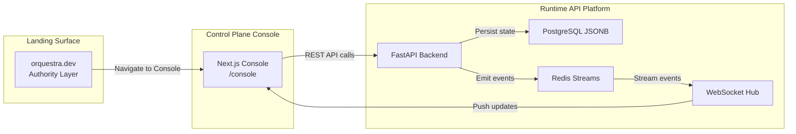
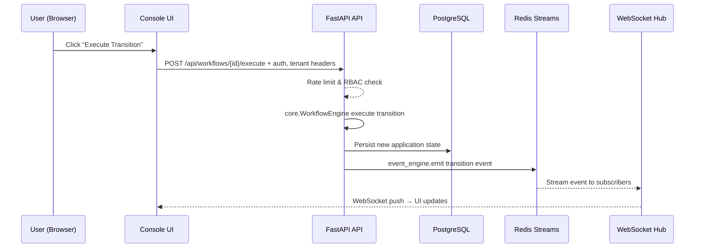

# ORQUESTRA - A Headless-API-ERP

Orquestra is a headless, AI-native ERP infrastructure for universities and edtech, enabling natural language deployment of validated workflow blueprints, event-driven backends, and secure multi-tenant control planes.

## Overview

This repo implements programmable institutional workflows as deterministic state machines. Developers describe processes in English; AI generates/deploys infrastructure including workflows, schemas, roles, and events. Targets admissions, expanding to registration/HR.

![Master architecture: 4-layer control plane from client surfaces to data persistence.]

## Features

- **AI Blueprint Generator**: 4-stage validation (schema/graph/permission/compliance) before human-approved deployment.
- **Workflow Engine**: Safe, no-eval execution with real-time events via Redis streams.
- **Event Backbone**: Structured emissions (e.g., `workflow.transitioned`) for integrations.
- **Multi-Tenant Security**: JWT/API keys, RLS, CSP, zero-trust from ground up.
- **Developer Console**: Dashboard, templates, API playground, live event streams.

## Tech Stack

**Backend:** FastAPI (Python 3.11), PostgreSQL 15 (RLS/JSONB), Redis 7 (streams), OpenAI GPT-4 Turbo (function calling).

**Frontend:** Next.js 14 (React 18, App Router), Tailwind CSS (design tokens), Zustand, Monaco Editor.

**Security/Infra:** JWT/PyJWT, CSP headers, Railway/Vercel hosting, Sentry monitoring.

![Multi-tenant isolation: JWT → RLS → scoped queries.]

# Three-Surface Product Model & Request/Data Flow

## Overview

This section introduces Orquestra’s **Three-Surface Product Model**—the distinct user-facing, control, and runtime layers—and describes the canonical end-to-end request and data flow through the system. Understanding these surfaces and their interactions is critical to maintaining the core invariants: strict multi-tenant isolation, deterministic execution, immutable workflows, and real-time observability.

The three surfaces are:

1. **Authority Layer (Landing)**

The marketing and documentation gateway at orquestra.dev, guiding new users into the platform.

1. **Control Plane (Console)**

The Next.js-based developer interface at `/console` for managing projects, workflows, templates, AI compilation, and viewing events.

1. **Runtime API Platform**

The FastAPI backend exposing REST and WebSocket endpoints for deterministic workflow execution, persistence, event streaming, and API key management .

All user actions—whether via the Console UI or direct API calls—flow through a fixed pipeline:

**authentication + rate limiting → workflow execution → DB persistence → Redis Streams → WebSocket push** . Each transition emits a structured event, guaranteeing real-time observability and strict separation of concerns.

## Architecture Overview

## Component Structure

### 1. Presentation Layer

#### **Landing Pages** (`apps/web/src/app/(landing)`)

- **Purpose:** Authority and documentation gateway, routing users to Console, Docs, or Architecture overview.
- **Responsibilities:**- Marketing hero with “Launch Console”, “Read Docs”, “View Architecture” CTAs
- Three entry-point cards: Developer Console, Architecture & Runtime, API & Documentation

#### **Console Control Plane** (`apps/web/src/app/console`)

- **Purpose:** Developer-centric control plane UI for managing every aspect of institutional workflows and infrastructure.
- **Key Features:**- Project selector and context bar
- Workflow list, detail/editor, AI Blueprint Generator
- Template gallery and deploy flow
- ERP Architect canvas with version history
- Live event stream via WebSocket
- **Data Fetching:** Uses `@/lib/console-api` methods (e.g., `getProjects`, `listWorkflows`, `listEvents`) with tenant headers attached by Frontend Enforcement Middleware.

### 2. Business Layer

#### **Control Plane Services** (`apps/api/app/control_plane`)

| Service Module | Responsibility |
| --- | --- |
| `projects/service.py` | CRUD for projects |
| `workflows/service.py` | Validate, version, deploy workflows (invokes core engines) |
| `templates/service.py` | List, deploy templates |
| `api_keys/service.py` | Issue and revoke versioned API keys |
| `events/service.py` | Query historical events |

### 3. Data Access Layer

#### **Backend Engines & Middleware** (`apps/api/app`)

| Component | Purpose |
| --- | --- |
| `middleware/RateLimitMiddleware` | Redis-backed rate limiting |
| `core/workflow_engine.py` | Deterministic JSON state machine executor |
| `core/event_engine.py` | Emit events, write to PostgreSQL, push to Redis Streams |
| `core/rbac_engine.py` | Enforce action-level permissions |
| `core/schema_engine.py` | JSON Schema + Pydantic validation |
| `ws.py` (WebSocket hub) | Authenticate, scope, and broadcast real-time events |

### 4. Data Models

Orquestra persists everything as JSONB and immutable event records. Key tables:

- `**workflows**`: Definition + version + status
- `**applications**`: Workflow instances + current state
- `**events**`: Ordered domain events with payload, tenant context
- `**projects**`**, **`**institutions**`: Tenant and workspace isolation

## API Integration

**Core Endpoints for Control Plane & Runtime:**

- **Authentication**

• POST /api/auth/login

• GET /api/auth/me

- **Projects & Context**

• GET /api/projects

- **Workflows**

• GET /api/workflows

• POST /api/workflows → deploy new definition

- **Templates**

• GET /api/templates

• POST /api/templates/{id}/deploy

- **Events (History + Stream)**

• GET /api/events?limit=…

• WS /ws/events?institution_id={…}&project_id={…}

- **AI Blueprint**

• POST /api/ai/blueprint/compile

• POST /api/ai/blueprint/deploy

- **ERP Architect**

• GET /api/architect/{id}

• POST /api/architect/{id}/prompt

• POST /api/architect/{id}/compile

## Feature Flows

### Workflow Execution & Event Propagation

## Integration Points

- **Authentication & Tenant Enforcement**

All HTTP and WS endpoints require JWT + `X-Institution-Id`/`X-Project-Id` headers.

- **Rate Limiting**

Redis-backed middleware applies per-tenant quotas.

- **Event Backbone**

`EventEngine` writes to Redis Streams; `ws.py` subscribes and broadcasts.

- **Frontend Enforcement Middleware**

Intercepts requests to inject tenant context, enforce immutability, and guard validation/deploy flows.

## Key Classes Reference

| Class | Location | Responsibility |
| --- | --- | --- |
| `FastAPI` | `apps/api/app/main.py` | App setup, CORS, middleware, router mounting |
| `RateLimitMiddleware` | `apps/api/app/middleware/rate_limit.py` | Redis-backed HTTP rate limiting |
| `WorkflowEngine` | `apps/api/app/core/workflow_engine.py` | Deterministic state transition execution |
| `EventEngine` | `apps/api/app/core/event_engine.py` | Event emission → PostgreSQL + Redis Streams |
| `RbacEngine` | `apps/api/app/core/rbac_engine.py` | Action-level permission enforcement |
| `SchemaEngine` | `apps/api/app/core/schema_engine.py` | Blueprint & data model validation |
| `Hub` | `apps/api/app/ws.py` | WebSocket authentication, subscription, broadcast |
| `ConsoleShell` | `apps/web/src/components/console/ConsoleShell.tsx` | Master layout, context bar, sidebar navigation |
| `useEventStream` hook | `apps/web/src/lib/hooks/useEventStream.ts` | Backfill + WebSocket connection for real-time UI |
| `DOC_NAV_GROUPS` & `INTRODUCTION_PAGE` | `apps/web/src/data/docs.ts` | Three-Surface & Platform Invariants content |

---

**Citations:**

- Three-Surface Model definition
- Canonical Data Flow diagram
